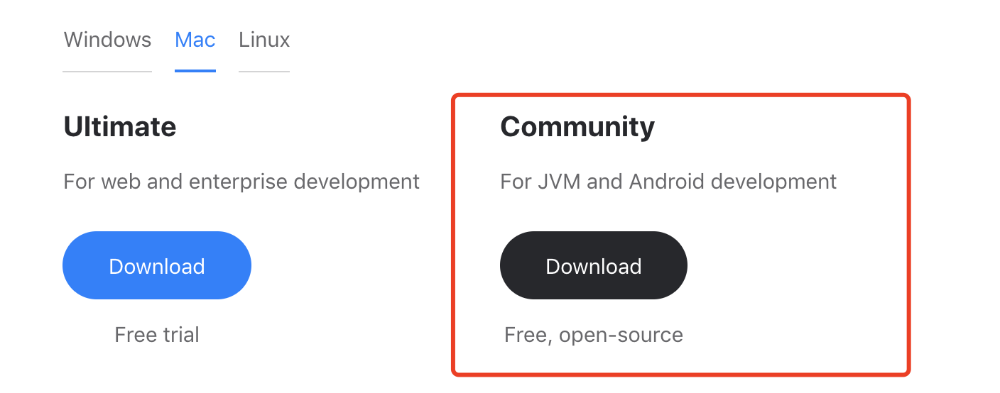

# 第一章如何搭建环境
#### 建议学习时间: 40分钟
##### 学习要点: 学会使用idea搭建maven环境和nukkit开发环境,并学习调试nukkit项目

搭建环境是我们使用nukkit的第一步，它虽然不是必要的一步，但是是我们进行简便开发的第一步。

1. 首先上[idea官网](https://www.jetbrains.com/idea/download/#section=mac)下载我们所需要的版本，我们
一般选择免费的Community版本，当然您也可以选择购买Ultimate版本,Community版本其实已经符合我们使用的需求，当然
作者使用的是Ultimate版本在此教学。
