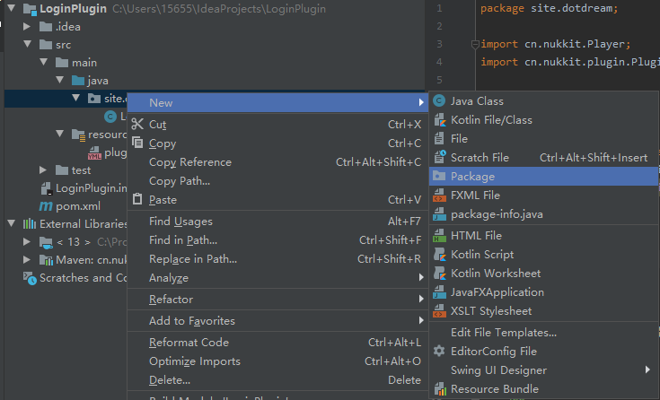
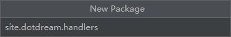
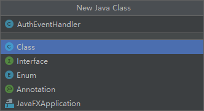
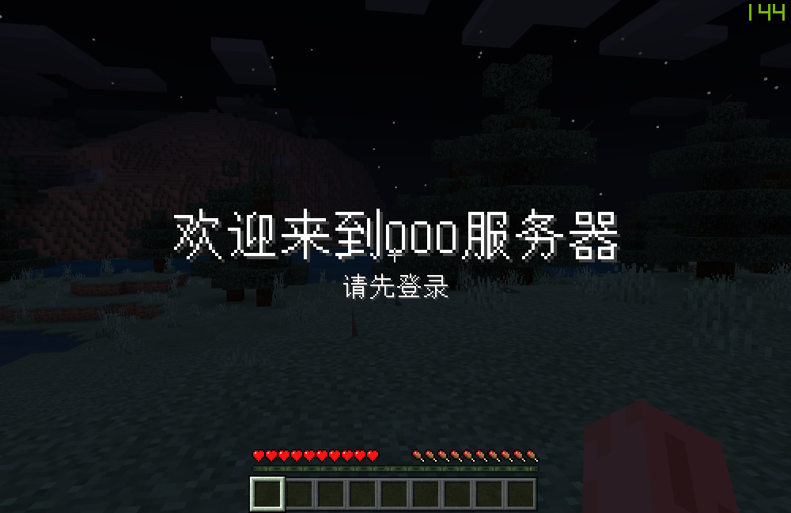
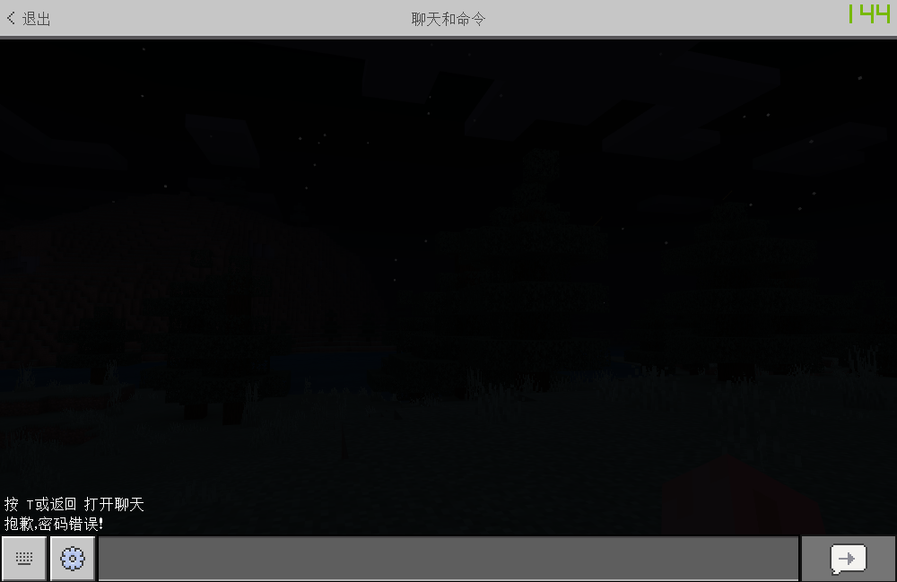
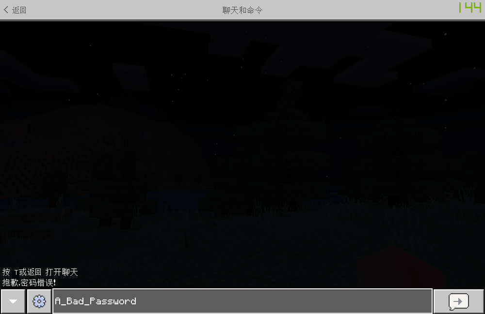
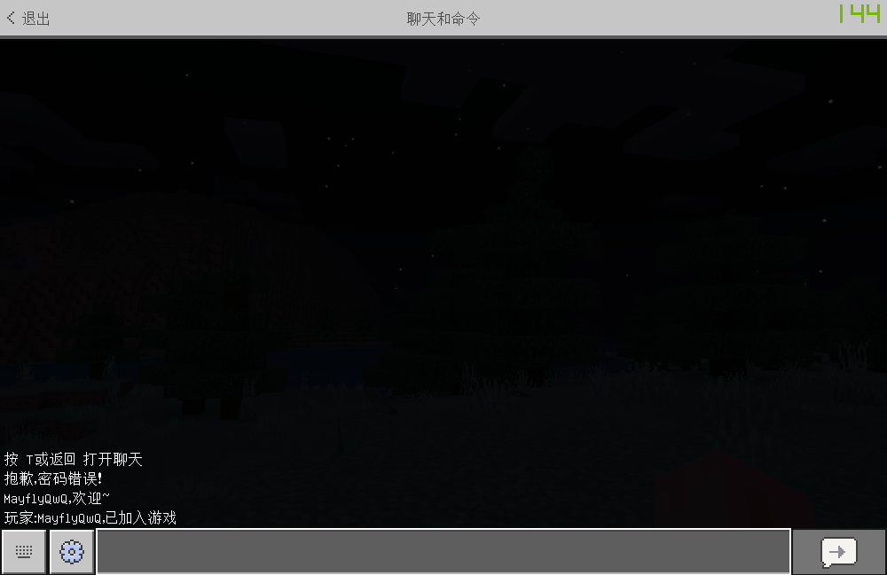
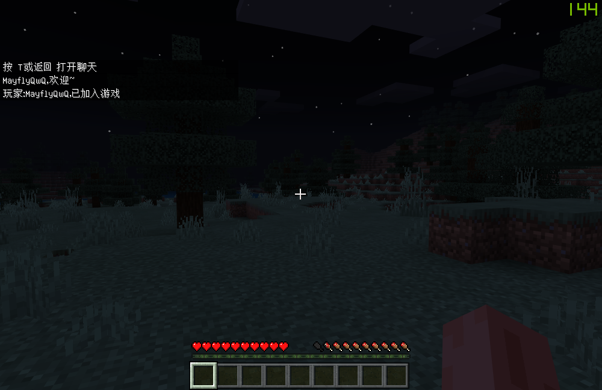
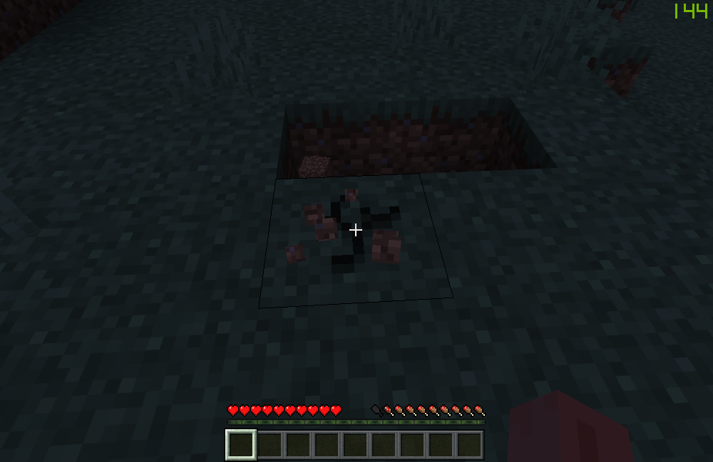

[上一章](第一章-主要的事件介绍.md) [下一章](第三章-计时器的介绍.md)
# 第二部分 第二章 事件相关方法
参与编写者: MayflyOvO

建议学习时间: 40分钟

学习要点: 重点记忆 Event 下各种方法的使用。要实际去编写。光看不写是记不起来的！

### 本章目录
- [前言](#1)
- [Nukkit&#32;插件初步配置](#2)
- [从玩家加入开始...](#3)
- [我不许你动&#32;你就不能动](#4)
- [禁止其余动作](#5)
- [当玩家离开](#6)
- [效果](#7)
- [最后](#8)


<span id="1"></span>
### 一、前言

本章我并不想单纯的去讲某个Event下面都有OOO方法，看了这么多章，我们来上手实现一个登录插件吧。通过这个插件来 **深入浅出** 学习各种Event的使用。

带有 :red_circle: 符号需要重点记忆理解

<span id="2"></span>
### 二、Nukkit 插件初步配置

关于Nukkit插件如何开始开发，已经由@Magic Lu同学在前面讲过了，此处不再赘述。

`Talk Is Cheap, Show You The Code`

plugin.yml
```yml
name: site.dotdream.loginplugin
main: site.dotdream.LoginPlugin
version: "1.0"
author: "MayflyOvO"
api: ["1.0.8"]
description: A Simple Auth Plugin
```

LoginPlugin.java(程序入口)
```java
package site.dotdream;

import cn.nukkit.Player;
import cn.nukkit.plugin.PluginBase;
import site.dotdream.handlers.AuthEventHandler;

import java.util.ArrayList;
import java.util.List;

public class LoginPlugin extends PluginBase {
    private static LoginPlugin plugin; // 插件实例
    private List<Player> loginPlayerList = new ArrayList<>(); // 已登录列表

    @Override
    public void onEnable() {
        plugin = this;

        this.getServer().getPluginManager().registerEvents(new AuthEventHandler(), this); // 注册Event
    }

    @Override
    public void onDisable() {

    }

    /**
     * 传入一个 Player
     * 返回 Boolean 判断该玩家是否在已登录列表内
     */
    public boolean isPlayerLogin(Player player) {
        return loginPlayerList.contains(player);
        /*
         * 通过 contains 方法
         * 如果玩家已登录这里返回 true
         * 反之返回 false
         * */
    }

    /**
     * 传入一个Player
     * 记录该玩家已经登陆
     */
    public void playerLogin(Player player) {
        this.loginPlayerList.add(player); // 将该玩家加入已登录玩家的List中
    }

    /**
     * 传入一个Player
     * 记录该玩家已经登出
     */
    public void playerLogout(Player player) {
        this.loginPlayerList.remove(player); // 将该玩家从已登录玩家的List中移除
    }

    /**
     * 通过这个方法获得Plugin实例
     */
    public static LoginPlugin getInstance() {
        return plugin;
    }
}

```

handlers/AuthEventHandler.java
```java
package site.dotdream.handlers;

import cn.nukkit.event.Listener;

public class AuthEventHandler implements Listener {
    private LoginPlugin plugin = LoginPlugin.getInstance();
}
```

添加Package



命名



创建类



可以看到我们定义了一个列表`loginPlayerList`来记录已经登录的玩家，同时创建了`isPlayerLogin`,`playerLogin`,`playerLogout`方法，来获取是否登录，以及操作该列表

然后我们又注册了一个Event。为了代码简洁方便维护，我建立了一个Package并将它独立放到一个叫AuthEventHandler的类里。同时又在onEnable中将它注册，使其生效。:wink:

到这里插件的初步配置就完成了，接下来我们大部分操作都在这个AuthEventHandler.java中...

### 三、从玩家加入开始...
<span id="3"></span>

我们在制作插件的时候，有必要认真的考虑一下插件的逻辑。

以本教程将要编写的登录插件为例，想要实现一个 `登录前 --> 输入密码 --> 登录后` ，那么势必要判断：
- 某玩家登录过了吗？
- 没有登陆？
- 那么我就 ~~禁止~~取消 你：走动，放置与破坏，伤害与被伤害，饥饿值变化，与其他玩家聊天。

为什么这里说是**取消**而不是**禁止**？

因为当玩家进行这些活动，Nukkit询问我们事先注册的Event

`Nukkit：你！插件LoginPlugin，对这个动作有什么意见吗？`

没有插件的情况下，这些动作都是会被同意的，通过一个重要的方法`event.setCancelled()`

告诉Nukkit

`LoginPlugin：我不同意！你要取消掉本次活动`

```
伪代码如下

如果 isPlayerLogin(玩家) 等于 否：
    Event设置为取消
否则：
    不设置取消，即是允许
```

这些都是为了实现我们的目标而需要考虑在内的

**好的，脑海中有了这些概念，我们来实际编写吧！**

向AuthEventHandler.java中加入如下代码
```java
    @EventHandler
    public void onPlayerJoin(PlayerJoinEvent event) {
        Player player = event.getPlayer(); // 重要方法！可以通过getPlayer来获得该动作发起的玩家

        /* PlayerJoinEvent 独有方法，用来设置玩家欢迎词
        这里玩家刚刚加入还没有登录
        我们将其设为空字符串，暂时先不欢迎
        */
        event.setJoinMessage("");

        plugin.getServer().getScheduler().scheduleDelayedTask(plugin, () -> {
            player.sendTitle("欢迎来到OOO服务器", "请先登录", 20, Integer.MAX_VALUE, 20);
        }, 2 * 20);
    }
```
这里涉及了几个方法，我们来分开说：

1. :red_circle:**event.getPlayer()** 很常用的方法，也很重要，通过它，我们可以获得这个动作(Event)的发起者。
2. :red_circle:**event.setJoinMessage()** 这是一个PlayerJoinEvent独有的方法。通过它，我们可以设置这名玩家加入服务器后，发送一条向全服广播某玩家已加入游戏的消息
3. **player.sendTitle()** 这个方法可以向玩家发送两行几乎占满全屏的字，它接受5个参数：(第一行字，第二行字，渐入的时间，显示的时间，渐出的时间)，需要注意的是，Nukkit使用红石刻计算时间，也就是20刻=1秒钟。将显示的时间设为Integer变量的最大值，让其一直显示，直到取消。**同时这里还涉及一个Nukkit的BUG，如果直接在玩家加入时发送Message或者Title，玩家是不显示的，所以使用`DelayedTask`做了2秒延迟**

这样我们就对新加入的玩家发送了一个要求登录的提示。

那取消未登录玩家的放置破坏啥的在哪呢？

别急！我们这就来~

<span id="4"></span>
### 四、我不许你动 你就不能动

继续向AuthEventHandler.java中加入如下代码

```java
    @EventHandler
    public void onPlayerMove(PlayerMoveEvent event) {
        Player player = event.getPlayer();

        if (!plugin.isPlayerLogin(player)) {
            // 当返回false，则玩家处在未登录状态
            Location from = event.getFrom();
            Location to = event.getTo();
            if (from.getX() != to.getX() || from.getZ() != to.getZ()) {
                // 当移动前地点 from 与 移动后地点 to 的 X，Z 坐标有任何一项不相等
                event.setCancelled();
            }
        }
    }
```

同样的方法不再解释，我们主要来看 :red_circle:**event.getFrom()** 与 :red_circle:**event.getTo()**
这两个方法为PlayerMoveEvent特有的方法，并且都能够得到一个类型为Location的变量，区别是from为玩家移动前的位置，to为玩家移动后的位置

Location类型变量包含4个值得注意的方法
```java
getX() // 玩家X坐标
getY() // 玩家Y坐标（高度）
getZ() // 玩家Z坐标
getDirectionVector() // 玩家视角
```

所以，当我们判断玩家的X，Y其中任何一个值不相等，就可以:red_circle:`event.setCancelled()`来告诉Nukkit，我不批准！这样玩家此次的移动就会被取消。

同理，大部分的Event都可以通过`setCancelled()`来取消。但是例如`PlayerQuitEvent`便不可以，因为你没有办法阻止玩家离开服务器。

在这里需要大家思考，为什么不
```java
if(!to.equals(from)){
    event.setCancelled();       
}
// 或者
if (from.getX() != to.getX() || from.getY() != to.getY() || from.getZ() != to.getZ()){
    // ...
}
```
这样会有什么缺点？

<span id="5"></span>
### 五、禁止其余动作

以下的代码禁止了：
1. 放置与破坏
2. 玩家模型碰撞
3. 玩家饥饿值变化

它们相比之前并没有什么特殊，无非是检查是否登录，判断是否取消，我直接放代码在这里
```java
    /**
     * 放置方块Event
     */
    @EventHandler
    public void onBlockPlace(BlockPlaceEvent event) {
        if (!plugin.isPlayerLogin(event.getPlayer())) {
            event.setCancelled();
        }
    }

    /**
     * 破坏方块Event
     */
    @EventHandler
    public void onBlockBreak(BlockBreakEvent event) {
        if (!plugin.isPlayerLogin(event.getPlayer())) {
            event.setCancelled();
        }
    }

    /**
     * 玩家模型碰撞Event
     */
    @EventHandler
    public void onPlayerInteractEvent(PlayerInteractEvent event) {
        if (!plugin.isPlayerLogin(event.getPlayer())) {
            event.setCancelled();
        }
    }

    /**
     * 玩家饥饿值变化Event
     */
    @EventHandler
    public void onPlayerFoodLevelChangeEvent(PlayerFoodLevelChangeEvent event) {
        if (!plugin.isPlayerLogin(event.getPlayer())) {
            event.setCancelled();
        }
    }
```

除以上几个Event外，存在2个需要大家重点看的Event
1. 玩家伤害及受伤害
2. 与其他玩家聊天

先上代码吧...
```java
    /**
     * 实体伤害Event
     */
    @EventHandler
    public void onEntityDamage(EntityDamageEvent event) {
        Player player = null; // 先定义一个Player变量
        if (event.getEntity() instanceof Player) {
            // 如果受到伤害的实体是一名玩家
            player = (Player) event.getEntity(); // 强制转换实体为Player类型，并赋值。
        } else if (event instanceof EntityDamageByEntityEvent) {
            // 如果本次Event属于被一个实体被另一个实体攻击的Event
            Entity damager = ((EntityDamageByEntityEvent) event).getDamager(); // 获得本次Event的发起者
            if (damager instanceof Player)
                // 如果发起伤害的实体是一名玩家
                player = (Player) damager;
        } else if (event instanceof EntityDamageByChildEntityEvent) {
            // 如果本次Event属于被一个实体被另一个实体的子实体攻击的Event
            Entity damager = ((EntityDamageByChildEntityEvent) event).getDamager(); // 获得本次Event的发起者
            if (damager instanceof Player)
                // 如果发起伤害的实体是一名玩家
                player = (Player) damager;
        }

        if (player != null && !plugin.isPlayerLogin(player)) {
            event.setCancelled();
        }
    }
```
这个EntityDamageEvent比较特殊，它没有 `getPlayer()` 方法，因为它是一个涵盖的很广，不仅仅是玩家的行为会调用这个Event。

例如：
1. 玩家对玩家造成伤害 （发起受到伤害的是玩家）
2. 玩家对生物造成伤害 （发起伤害的是玩家）
3. 生物对玩家造成伤害 （受到伤害的是玩家）
4. 玩家的箭对玩家造成伤害 （子实体）

这些都会调用这个方法。我们可以根据判断：发起伤害的实体:red_circle:`getDamager()`和受到伤害的实体:red_circle:`getEntity()`，只要其中有一个是未登录的玩家，就取消本次Event。

然后是：
```java
    /**
     * 玩家聊天Event
     */
    @EventHandler
    public void onPlayerChat(PlayerChatEvent event) {
        Player player = event.getPlayer();
        if (!plugin.isPlayerLogin(event.getPlayer())) {
            String message = event.getMessage(); // 获取玩家发送的内容
            if (message.equals("A_Bad_Password")) {
                /*
                 * 这里判断是否密码正确
                 * ！但仅是为了举例，通常需要将message用md5之类的非对称加密算法加密
                 * ！然后再与之前就保存在数据库里的结果进行比对
                 */
                plugin.playerLogin(player); // 将玩家加入已登录的列表(List)中
                player.sendTitle("", "", 0, 0, 0); // 还记得我们给玩家发了一个占满全屏的两行提示吗？在这里我们把它取消。
                // 另一个BUG player.clearTitle() 在这里不起作用

                player.sendMessage(player.getName() + "，欢迎~"); // 给这个玩家发送欢迎消息
                // 或者
                plugin.getServer().broadcastMessage("玩家：" + player.getName() + "，已加入游戏"); // 给全服的玩家发送该玩家已加入的欢迎消息
            } else {
                player.sendMessage("抱歉，密码错误！");
            }
            event.setCancelled(); // 在 if 外取消，确保无论密码正确与否，都不会发送给其他玩家看到
        }
    }
```

我们在这里编写了玩家聊天与输入密码的逻辑
先判断玩家是否已登录，然后通过:red_circle:`event.getMessage()`获得消息，实际上也就是密码，来做对比。如果错误进行提示，如果正确则将其加入已登录玩家的列表中。

这时我们回头来看之前写的全部Event，如果该玩家登陆成功后，由于已被加入`loginPlayerList`中，此时`isPlayerLogin()`便会返回true，条件不成立，玩家的各种活动便不会被取消。

> ——发散一下思维，也可以在这里修改玩家发送的内容。加称号等等都是如此实现的。

<span id="6"></span>
### 六、当玩家离开

当玩家登录，我们把他保存在`loginPlayerList`中。最后，当玩家离开，我们还需要将他移除，不然，如果一名玩家登录后下线，某人冒充顶替的话再上线的话，由于已登录列表中有他，就不需要登录了。

```java
    @EventHandler
    public void onPlayerQuit(PlayerQuitEvent event) {
        if (plugin.isPlayerLogin(event.getPlayer())) {
            // 如果玩家在线，将其移除，反之不用管
            plugin.playerLogout(event.getPlayer());
        }
    }
```
<span id="7"></span>
### 七、效果








<span id="8"></span>
### 八、最后

一个简单的登录插件就编写完了。希望大家能够了解一些Event下面的方法，最重要的是去实践。无论是Eclipse还是IDEA，都自带了非常友好的提示功能。还有反编译。可以直接通过方法名，类名来了解Nukkit。

当然，这个插件还有一部分功能是残缺的，比如注册。有一些Event没有禁止掉，比如扔物品和捡起物品。这些都等待屏幕前的你来开发。

[上一章](第一章-主要的事件介绍.md) [下一章](第三章-计时器的介绍.md)
